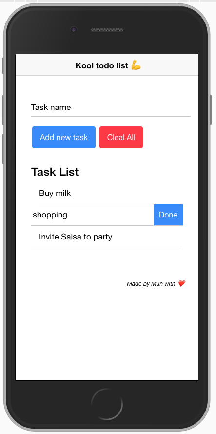

# Todo Project with Ionic framework (3+)

## User Story

Build a simple Ionic app with a list view in which you can add and delete items.

## Stucks

- [ ] After click Add button, can't set focus to input
- [ ] NEED ANSWER - Styling is the same web development or not ?
